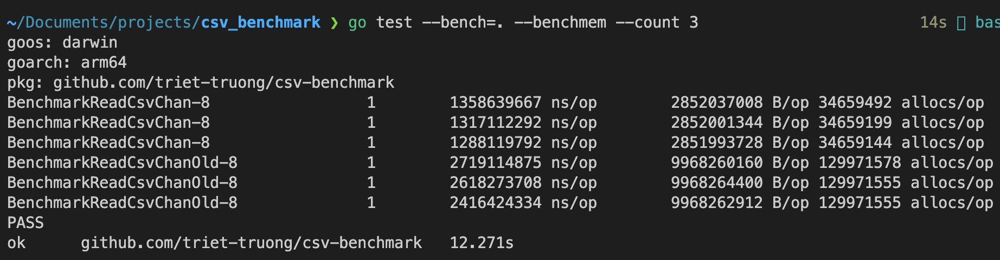

# CSV benchmark
A simple CLI application to benchmark two approaches of parsing large CSV file:
- gocsv: Read whole file, load whole content to memory before iterating every line. (`readCsvChanOld`) 
- csvutil: read file and decode line by line. (`readCsvChan`)

```shell
go test --bench=. --benchmem --count 3
```

Result screenshot:


## Appendix

While working on this tool, `git` show warnings on data.csv file:

```log
remote: warning: See http://git.io/iEPt8g for more information.
remote: warning: File data.csv is 53.33 MB; this is larger than GitHub's recommended maximum file size of 50.00 MB
remote: warning: GH001: Large files detected. You may want to try Git Large File Storage - https://git-lfs.github.com.
```

So I followed the link and applied:

```shell
brew install git-lfs
```

```shell
git lfs install
```

```shell
git lfs track "*.csv"
```

```shell
git add .gitattributes
```

Because data.csv is already pushed to the repository, I need to use this command to import existing files to LFS:

```shell
git lfs migrate import
```

```shell
git commit "add .gitattributes"
```

```shell
git push
```
